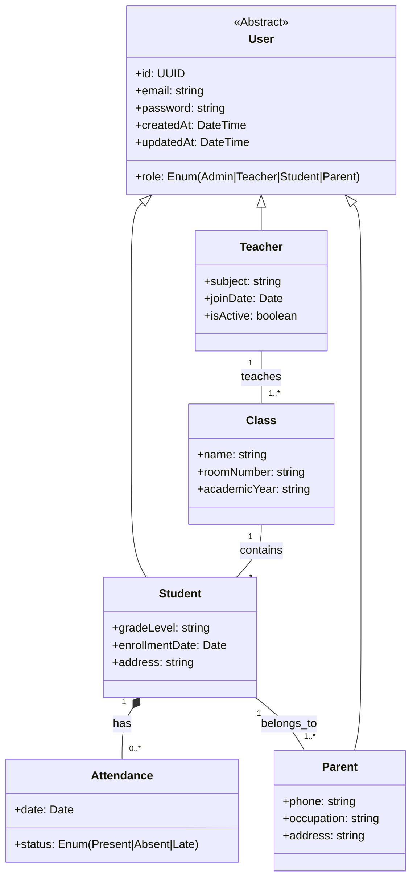

Here’s the **updated Class Diagram** for your **School Management System** (Backend Focus) with the `Parent` entity included, showing relationships with `User`, `Student`, and other key entities:



---

### **Key Relationships Explained**:
1. **Inheritance (`User` → `Parent/Student/Teacher`)**  
   - All roles extend the base `User` class (shared fields like `id`, `email`).  
   - `role` enum differentiates permissions.

2. **Parent-Student Relationship**  
   - A `Parent` can have **one or more** `Student` children (1-to-many).  
   - A `Student` **must belong to at least one** `Parent` (e.g., `student.parentId`).

3. **Attendance Tracking**  
   - Each `Student` has multiple `Attendance` records (1-to-many).  

4. **Class Management**  
   - A `Class` contains many `Student`s and is taught by one `Teacher`.

---

### **Suggested PostgreSQL Tables** (Based on Diagram):
```sql
CREATE TABLE users (
  id UUID PRIMARY KEY,
  email VARCHAR(255) UNIQUE NOT NULL,
  password VARCHAR(255) NOT NULL,
  role VARCHAR(20) NOT NULL CHECK (role IN ('Admin', 'Teacher', 'Student', 'Parent')),
  -- Common fields
  created_at TIMESTAMP DEFAULT NOW()
);

CREATE TABLE parents (
  user_id UUID PRIMARY KEY REFERENCES users(id),
  phone VARCHAR(20),
  occupation VARCHAR(100)
);

CREATE TABLE students (
  user_id UUID PRIMARY KEY REFERENCES users(id),
  grade_level VARCHAR(50),
  parent_id UUID NOT NULL REFERENCES parents(user_id)
);
```

---

### **Need Adjustments?**
- Want to add **fee payments** or **exam results** to the diagram?  
- Need **NestJS entity code** for these classes?  
- Should we include **soft delete** fields (`isDeleted`)?  

Let me know how to refine further! 🎓